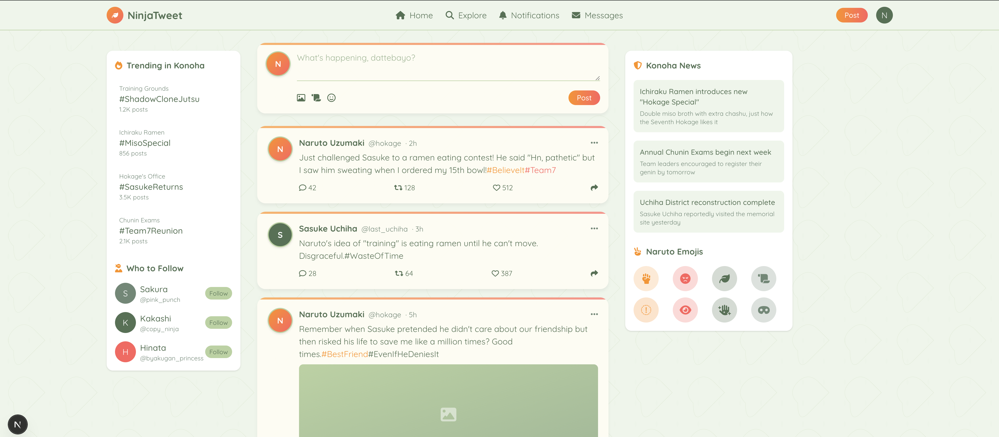

This is a [Next.js](https://nextjs.org) project bootstrapped with [`create-next-app`](https://github.com/vercel/next.js/tree/canary/packages/create-next-app).

## Getting Started

First, run the development server:

```bash
npm run dev
# or
yarn dev
# or
pnpm dev
# or
bun dev
```

Open [http://localhost:3000](http://localhost:3000) with your browser to see the result.

You can start editing the page by modifying `app/page.js`. The page auto-updates as you edit the file.

This project uses [`next/font`](https://nextjs.org/docs/app/building-your-application/optimizing/fonts) to automatically optimize and load [Geist](https://vercel.com/font), a new font family for Vercel.

## Learn More

To learn more about Next.js, take a look at the following resources:

- [Next.js Documentation](https://nextjs.org/docs) - learn about Next.js features and API.
- [Learn Next.js](https://nextjs.org/learn) - an interactive Next.js tutorial.

You can check out [the Next.js GitHub repository](https://github.com/vercel/next.js) - your feedback and contributions are welcome!

## Deploy on Vercel

The easiest way to deploy your Next.js app is to use the [Vercel Platform](https://vercel.com) from the creators of Next.js.

Check out our [Next.js deployment documentation](https://nextjs.org/docs/app/building-your-application/deploying) for more details.

# NinjaTweet 🥷🍜

A whimsical Studio Ghibli-inspired X (Twitter) clone focused on the *feed experience*, themed around the world of Naruto.

Built with **Next.js**, **Tailwind CSS**, and **FontAwesome**, this project is a frontend-only concept showcasing UI/UX creativity and fandom fun.



---

## 🌟 Features

- Clean Twitter-like feed layout
- Konoha-inspired trending sidebar
- Playful "Who to Follow" suggestions
- Ninja-themed emojis
- Ghibli-esque pastel visual style

---

## 🚀 Getting Started

Clone the repository and run the local development server:

```bash
git clone https://github.com/binarycodebarn//example-twitter-studio-ghibli.git
cd /example-twitter-studio-ghibli
npm install
npm run dev
```

Then open your browser at: [http://localhost:3000](http://localhost:3000)

### 🚠 Tech Stack

- **Next.js** (App Router)
- **Tailwind CSS** for styling
- **FontAwesome** for icons

---

## 🧠 Who Made This?

Created by [Binary Code Barn](https://binarycodebarn.com), a Berlin-based software consulting company. This is a fun open-source example project for inspiration and practice.

---

## 🔗 Links

- 🔗 [Binary Code Barn](https://binarycodebarn.com)
- 🧑‍💻 [Our GitHub](https://github.com/binarycodebarn)

---

## 📄 License

This project is open source under the **MIT License**. Feel free to fork, remix, or use parts of it for your own apps!

